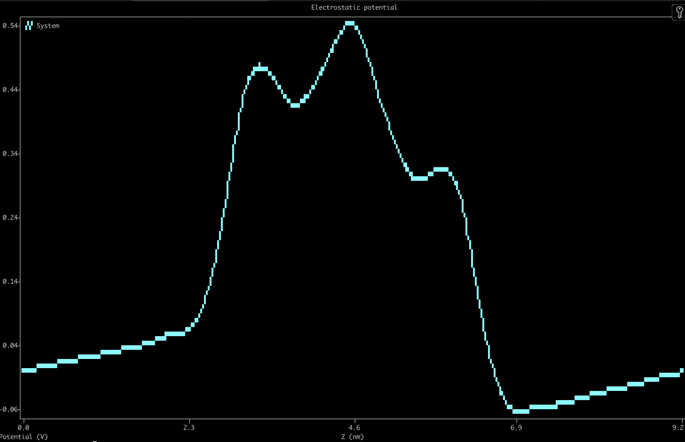
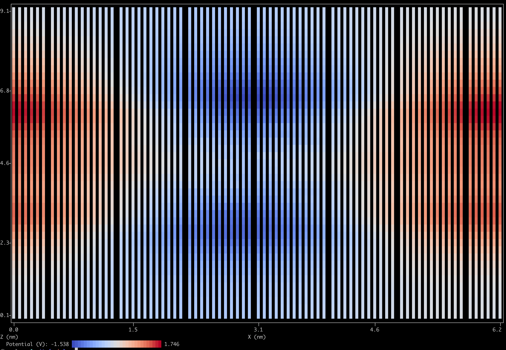

# gplot

A command-line tool for quick terminal plotting of GROMACS `.xvg` files and 2D grid data. No GUI needed — plots are rendered directly in your terminal using Unicode characters.

`gplot` automatically reads axis labels, titles, and series legends from the xmgrace-style metadata (`@` lines) embedded in `.xvg` files. It also supports 2D heatmap visualization of grid data with colormaps.

## Installation

```bash
pip install -e .          # terminal plotting only
pip install -e ".[png]"   # also enables --png (adds matplotlib)
```

This installs `gplot` as a command available anywhere in your terminal, along with the required `plotext` library. The `[png]` extra pulls in matplotlib for optional PNG export.

## Usage

### Basic plot

Plot column 1 (X) vs column 2 (Y):

```bash
gplot myfile.xvg
```

### Selecting columns

Columns are numbered starting from 1. Use `-x` and `-y` to choose which columns to plot:

```bash
gplot output.xvg -y 3        # column 1 vs column 3
gplot output.xvg -x 2 -y 4   # column 2 vs column 4
```

### Plot all columns

Use `--all` to plot every data column against the X column in a single plot:

```bash
gplot output.xvg --all
```

### Comparing multiple files

Pass multiple files to overlay them on the same plot. Each series gets a distinct color and marker automatically:

```bash
gplot sim1/energy.xvg sim2/energy.xvg
```

Per-file column selection is available with `-f<N>x` and `-f<N>y` flags (where `<N>` is the file number, starting from 1). Files without per-file flags use the global `-x` / `-y` defaults:

```bash
# file 1: col 1 vs col 2 (default), file 2: col 1 vs col 3
gplot run1.xvg run2.xvg -f2y 3

# both files with explicit columns
gplot run1.xvg run2.xvg -f1y 2 -f2y 4
```

### Overriding labels and title

```bash
gplot myfile.xvg -t "My Title" --xlabel "Time (ns)" --ylabel "RMSD (nm)"
```

### Adjusting plot size

```bash
gplot myfile.xvg -W 120 -H 30   # width and height in characters
```

### Saving to PNG

Add `--png OUT` to render the terminal plot **and** save a high-resolution PNG (requires the `[png]` extra):

```bash
gplot myfile.xvg --png plot.png
gplot --heatmap potential_2d.dat --png heatmap.png
```

## 2D heatmaps

Use `--heatmap` to plot 2D grid data from a 3-column (x, y, z) text file:

```bash
gplot --heatmap potential_2d.dat
```

### Colormaps

Choose a colormap with `--cmap`:

```bash
gplot --heatmap --cmap coolwarm potential_2d.dat
```

Available colormaps: `viridis` (default), `plasma`, `coolwarm`, `bwr`, `hot`.

### Clamping the color range

Use `--vmin` and `--vmax` to set the color scale limits:

```bash
gplot --heatmap --vmin -0.5 --vmax 0.5 potential_2d.dat
```

### 2D input format

The heatmap expects a text file with three whitespace-separated columns: X, Y, and Z (value). Comment lines starting with `#` are supported. Axis labels are auto-detected from a header comment like:

```
# Columns: X (nm)  Z (nm)  Potential (V)
```

The first non-trivial `#` comment line is used as the plot title.

## Options reference

| Flag | Description |
|---|---|
| `-x N` | Column for X axis (1-based, default: 1) |
| `-y N` | Column for Y axis (1-based, default: 2) |
| `--all` | Plot all Y columns against X |
| `-t`, `--title` | Override plot title |
| `--xlabel` | Override X axis label |
| `--ylabel` | Override Y axis label |
| `-W`, `--width` | Plot width in characters |
| `-H`, `--height` | Plot height in characters |
| `-f<N>x M` | X column for file N |
| `-f<N>y M` | Y column for file N |
| `--heatmap` | Plot 2D heatmap from 3-column grid data |
| `--cmap NAME` | Colormap: viridis, plasma, coolwarm, bwr, hot |
| `--vmin V` | Min value for heatmap color scale |
| `--vmax V` | Max value for heatmap color scale |
| `--png PATH` | Also save the plot as a PNG (requires the `[png]` extra) |

## .xvg file format

GROMACS tools produce `.xvg` files with the following conventions:

- Lines starting with `#` are comments (ignored)
- Lines starting with `@` contain xmgrace metadata (title, axis labels, legends)
- Data lines contain whitespace-separated numeric columns

`gplot` parses the `@` metadata to automatically set the plot title, axis labels, and series legends.
